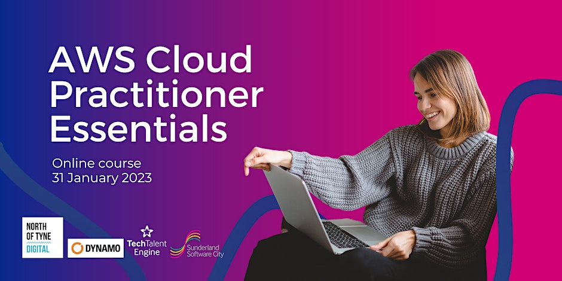
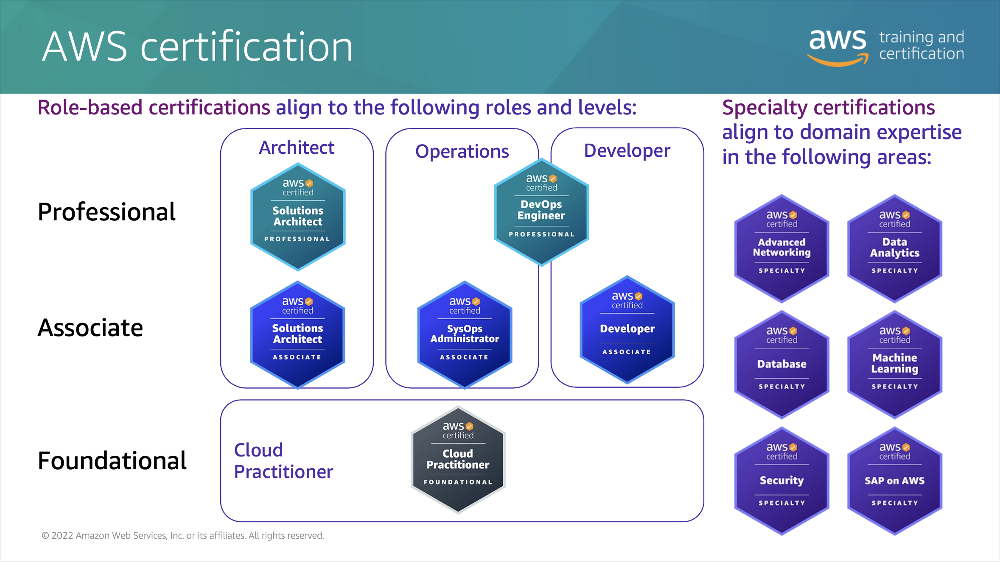

<!-- # AWS Certified Cloud Practitioner -->

Today I passed the **AWS Certified Cloud Practitioner** exam 🎉!

- [Credly Badge](https://www.credly.com/badges/a3c0cb2e-612c-4463-a7f0-7da98f8343e8)
  - [Credly Profile](https://www.credly.com/users/alexhedley/badges)

The pass mark is 700 / 1000 and I achieved: **780**.

> The AWS Certified Cloud Practitioner offers a foundational understanding of AWS Cloud concepts, services, and terminology. This is a good starting point for individuals in non-technical roles with no prior IT or cloud experience or for those with on-premises IT experience looking for basic AWS Cloud fluency. This certification can give candidates the confidence to tackle role-based AWS Certifications.

I took this in a Pearson VUE testing center instead of an online proctored exam. Don't need to worry about the internet dropping out etc.

## Training Material

Saw a post on [LinkedIn](https://www.linkedin.com/feed/update/urn:li:activity:7019288272430333952) for an all day training event.

> AWS Cloud Practitioner Essentials  
> Tuesday, 31 January 2023 09:00 (GMT)  

- [Event Link](https://www.eventbrite.co.uk/e/aws-cloud-practitioner-essentials-tickets-488693313857)
  - [Tech Talent Engine](https://techtalentengine.co.uk)

This was an excellent all day training session from _Stefania Gelpi_ - AWS Partner Trainer.

## Resources

- [Site](https://aws.amazon.com/certification/certified-cloud-practitioner/)

Links

- [AWS Certified Cloud Practitioner Exam Guide](https://d1.awsstatic.com/training-and-certification/docs-cloud-practitioner/AWS-Certified-Cloud-Practitioner_Exam-Guide.pdf)
- [AWS Certified Cloud Practitioner Sample Questions](https://d1.awsstatic.com/training-and-certification/docs-cloud-practitioner/AWS-Certified-Cloud-Practitioner_Sample-Questions.pdf)
- [AWS Certified Cloud Practitioner Official Practice Question Set](https://explore.skillbuilder.aws/learn/course/external/view/elearning/12483/aws-certified-cloud-practitioner-practice-question-set-clf-c01-english)
- [Exam Prep: AWS Certified Cloud Practitioner](https://explore.skillbuilder.aws/learn/course/external/view/elearning/9449/exam-prep-aws-certified-cloud-practitioner-foundations)
- [Exam Readiness: AWS Certified Cloud Practitioner](https://aws.amazon.com/training/events/?get-certified-vilt-courses-cards.sort-by=item.additionalFields.startDateSort&get-certified-vilt-courses-cards.sort-order=asc&awsf.get-certified-vilt-courses-type=*all&awsf.get-certified-vilt-courses-series=series%23aws-certification-exam-readiness&awsf.get-certified-vilt-audience=*all&awsf.get-certified-vilt-locations=*all&awsf.get-certified-vilt-countries=*all&awsf.get-certified-vilt-languages=*all&awsf.get-certified-vilt-courses-level=level%23100&awsf.get-certified-vilt-courses-tech-category=*all&cp=sec&sec=prep)

Cloud Quest

- [AWS Cloud Quest](https://aws.amazon.com/training/digital/aws-cloud-quest/)
- [AWS Cloud Quest: Cloud Practitioner](https://pages.awscloud.com/global_traincert_twitch-cloud-quest-CP.html)

## Exam overview

Level: Foundational  
Length: 90 minutes to complete the exam  
Cost: 100 USD (+VAT)  

Format: 65 questions; either multiple choice or multiple response  
Delivery method: Pearson VUE testing center or online proctored exam.  

## Options

There are other certifications available, I'll prob start on the **Associate Developer** one next.

FOUNDATIONAL

- Cloud Practitioner

Knowledge-based certification for foundational understanding of AWS Cloud.  
**No prior experience needed.**

ASSOCIATE

- Solutions Architect
- Developer
- SysOps Administrator

Role-based certifications that showcase your knowledge and skills on AWS and build your credibility as an AWS Cloud professional.  
**Prior cloud and/or strong on-premises IT experience recommended.**

PROFESSIONAL

- Solutions Architect
- DevOps Engineer

Role-based certifications that validate advanced skills and knowledge required to design secure, optimized, and modernized applications and to automate processes on AWS.  
**2 years of prior AWS Cloud experience recommended.**

SPECIALTY

- Advanced Networking
- Data Analytics
- Database
- Machine Learning
- Security
- SAP on AWS

Dive deeper and position yourself as a trusted advisor to your stakeholders and/or customers in these strategic areas.  
**Refer to the exam guides on the exam pages for recommended experience.**
