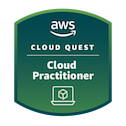

<!-- # AWS Cloud Quest Cloud Practitioner -->

Today I completed the **AWS Cloud Quest Cloud Practitioner** training 🎉!

- [Credly Badge](https://www.credly.com/badges/8056f265-da5b-4518-9c7c-9768dc379721/public_url)
  - [Credly Profile](https://www.credly.com/users/alexhedley/badges)

This is a free course from AWS that uses gamification and hands on labs to reinforce learnings.

> How does it work?
> 
> You will solve problems throughout the virtual Cloud Quest city by completing learning exercises like labs, quizzes, and puzzles.
> 
> Through hands-on learning in a live AWS environment, you will learn and apply cloud concepts to real business problems while earning rewards and transforming the city. Ready to begin? Enroll to start your quest.

## Training Material

- [Skill Builder Course](https://explore.skillbuilder.aws/learn/course/external/view/elearning/11458/aws-cloud-quest-cloud-practitioner)
- [Training Material](https://aws.amazon.com/training/learn-about/cloud-practitioner/)

## Links

- [AWS Cloud Quest](https://aws.amazon.com/training/digital/aws-cloud-quest/)
- [AWS Cloud Quest: Cloud Practitioner](https://pages.awscloud.com/global_traincert_twitch-cloud-quest-CP.html)
