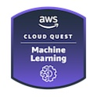

<!-- # AWS Cloud Quest Machine Learning -->

Today I completed the **AWS Cloud Quest Machine Learnings** training 🎉!

- [Credly Badge](https://www.credly.com/badges/0b283f21-b9cd-408e-9b54-f01cab2d3aa1/public_url)
  - [Credly Profile](https://www.credly.com/users/alexhedley/badges)

This is a paid course from AWS that uses gamification and hands on labs to reinforce learnings.

> Part of AWS Skill Builder Individual subscription. Subscribe to get access to this and other subscriber-only benefits.  
> $29.00 / month + VAT  
> https://explore.skillbuilder.aws/learn/signin  

> As the Machine Learning specialist, you will implement solutions using AWS AI services and trained models. You will build, train, and deploy Machine Learning models, as well as integrate AWS AI services into solutions. You will gain hands on experience with AI/ML topics like reinforcement learning, anomaly detection, text to speech, transcription and computer vision.

## Training Material

- [Training Material](https://aws.amazon.com/training/learn-about/cloud-practitioner/)

## Links

- [AWS Cloud Quest](https://aws.amazon.com/training/digital/aws-cloud-quest/)
- [Cloud Quest](https://explore.skillbuilder.aws/learn/course/external/view/elearning/7636/cloud-quest)

<!-- ## Resources Used -->
