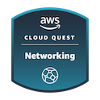

<!-- # AWS Cloud Quest Networking -->

Today I completed the **AWS Cloud Quest Networking** training 🎉!

- [Credly Badge](https://www.credly.com/badges/8f0220d0-0704-4ce2-8650-4ffbf090bf4b/public_url)
  - [Credly Profile](https://www.credly.com/users/alexhedley/badges)

## Notes

_AWS Step Functions_ took me back to my Symantec Workflow days. It was a nice UI to work with and interesting to see the JSON output.
A new resource I got to try was _Amazon QuickSight_, seems very handy when linked with _Amazon Athena_ to build some very useful dashboards.

## Info

This is a paid course from AWS that uses gamification and hands on labs to reinforce learnings.

> Part of AWS Skill Builder Individual subscription. Subscribe to get access to this and other subscriber-only benefits.  
> $29.00 / month + VAT  
> https://explore.skillbuilder.aws/learn/signin  

> As the city’s Networking specialist, you will leverage AWS services to scale network connectivity, connect to on-premisses networks, protect applications, analyze network traffic and identify suspicious activity. As you build real solutions, you will explore concepts such as network tunneling, peering, cross region routing and log analysis.

## Links

- [AWS Cloud Quest](https://aws.amazon.com/training/digital/aws-cloud-quest/)
- [Cloud Quest](https://explore.skillbuilder.aws/learn/course/external/view/elearning/7636/cloud-quest)

## Resources Used

- Amazon Athena
- Amazon CloudFront
- Amazon CloudWatch
- Amazon EC2
- Amazon EC2 Auto Scaling
- Amazon QuickSight
- Amazon Relational Database Service (RDS)
- Amazon Route 53
- Amazon S3
- Amazon SNS
- Amazon VPC
- AWS
- AWS Cloud Trail
- AWS CloudFormation
- AWS CloudWatch
- AWS Glue
- AWS Lambda
- AWS Network Firewall
- AWS Private Link
- AWS Site-to-Site VPN
- AWS Step Functions
- AWS Systems Manager
- AWS Transit Gateway
- AWS WAF
- Elastic Load Balancing (ELB)
