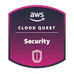

<!-- # AWS Cloud Quest Machine Learning -->

Today I completed the **AWS Cloud Quest Security** training 🎉!

- [Credly Badge](https://www.credly.com/badges/e53bb657-c1ca-4b8a-a8a0-d14935c52717/public_url)
  - [Credly Profile](https://www.credly.com/users/alexhedley/badges)

This is a paid course from AWS that uses gamification and hands on labs to reinforce learnings.

> Part of AWS Skill Builder Individual subscription. Subscribe to get access to this and other subscriber-only benefits.  
> $29.00 / month + VAT  
> https://explore.skillbuilder.aws/learn/signin  

> Use AWS security services to build solutions that respond to incidents, remediate quickly, detect vulnerabilities, and prevent data loss.

## Training Material

- [Training Material](https://aws.amazon.com/training/learn-about/cloud-practitioner/)

## Links

- [AWS Cloud Quest](https://aws.amazon.com/training/digital/aws-cloud-quest/)
- [Cloud Quest](https://explore.skillbuilder.aws/learn/course/external/view/elearning/7636/cloud-quest)

## Resources Used

- Amazon API Gateway
- Amazon Athena
- Amazon CloudFront
- Amazon CloudWatch
- Amazon Cognito
- Amazon DynamoDB
- Amazon EC2
- Amazon EC2 Auto Scaling
- Amazon EventBridge
- Amazon Kinesis
- Amazon Lambda
- Amazon Relational Database Service (RDS)
- Amazon S3
- Amazon SNS
- Amazon VPC
- Amazon WAF
- AWS Amplify
- AWS CloudFormation
- AWS Cognito
- AWS Config
- AWS Glue
- AWS Identity and Access Management (IAM)
- AWS Key Management Service (KMS)
- AWS Lambda
- AWS Secrets Manager
- AWS Service Catalog
- AWS Systems Manager
