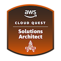

<!-- # AWS Cloud Quest Solutions Architect -->

Today I completed the **AWS Cloud Quest Solutions Architect** training 🎉!

- [Credly Badge](https://www.credly.com/badges/19d085e9-4a52-40b1-8d7c-2ff7eba1bd33/public_url)
  - [Credly Profile](https://www.credly.com/users/alexhedley/badges)

This is a paid course from AWS that uses gamification and hands on labs to reinforce learnings.

> Part of AWS Skill Builder Individual subscription. Subscribe to get access to this and other subscriber-only benefits.  
> $29.00 / month + VAT  
> https://explore.skillbuilder.aws/learn/signin

> Dive into a broad set of AWS services and build secure, fault-tolerant, and highly available AWS solutions.

## Training Material

- [Training Material](https://aws.amazon.com/training/learn-about/cloud-practitioner/)

## Links

- [AWS Cloud Quest](https://aws.amazon.com/training/digital/aws-cloud-quest/)
- [Cloud Quest](https://explore.skillbuilder.aws/learn/course/external/view/elearning/7636/cloud-quest)
