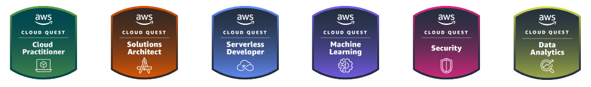

<!-- AWS Cloud Quest -->

Today I completed the **AWS Cloud Quest** training 🎉, all 6 sections are now complete!

> [AWS Cloud Quest](https://aws.amazon.com/training/digital/aws-cloud-quest/), Develop in-demand cloud skills in this fun, interactive role-playing game.

I'd set myself a target of doing one a month, which I think I achieved, given I also did a couple of other certs in that time.

The idea of gamification in learning really appeals to me. Who doesn't like collecting things? Another great thing about this training is it is hand-ons, you get to work with the actual AWS resources in a lab environment, just how you would with the real thing. The DIY section makes sure you've followed and understood what was required in the original ask and you can't complete the course if you don't configure your environment correctly. This has benefits over the [Certification](https://aws.amazon.com/certification/) exams as it's less about memory retrieval and more about understanding, although both have their merits.

I really enjoyed getting to learn some new Resources. I've been wanting to look at some _Machine Learning_ for quite a while, it was a lot of waiting around but it gave me an appreciation of what is possible. I might get my Bowling Scores analyser written one day. SageMaker could be key here. Also, who doesn't love some _Data Analytics_! This gave me an opportunity to try Kinesis and Lake Formation.

If you haven't already, I'd suggest trying the _Cloud Practitioner_ for free and there are offers to get some months free with the [AWS Skill Builder](https://skillbuilder.aws) platform, so keep an eye out for that.

## Stats

|             | Cloud Practitioner | Solutions Architect | Serverless Developer | Machine Learning | Security | Data Analytics |
| ----------- | ------------------ | ------------------- | -------------------- | ---------------- | -------- | -------------- |
| Gems        | 685                | 2380                | 1780                 | 3540             | 4355     | 2940           |
| Pets        | 1                  | 2                   | 1                    | 3                | 3        | 3              |
| Services    | 10                 | 34                  | 25                   | 44               | 53       | 40             |
| Cards       | 0                  | 0                   | 0                    | 0                | 6        | 0              |
| Rep. Points | 237                | 981                 | 726                  | 1460             | 1909     | 1335           |
| Challenges  | 0                  | 0                   | 0                    | 0                | 4        | 0              |

Got to Level **99**... need to top that off with some other questions.

I'd missed the opportunity for the Drone Challenges until near the end, so could finish those off too.

## Resources

A number of AWS Resources (54+) were included in the training. This gave a great coverage of the popular items and things you are most likely to encounter in your cloud journey.

(I didn't keep a list from _Cloud Practitioner_ but I'd assume they were covered in the others.)

> Amazon API Gateway, Amazon Athena, Amazon Cloud Formation, Amazon CloudFront, Amazon CloudWatch, Amazon Cognito, Amazon Comprehend, Amazon DynamoDB, Amazon EC2, Amazon EC2 Auto Scaling, Amazon Elastic Container Registry, Amazon Elastic Container Service, Amazon EMR, Amazon EventBridge, Amazon Kinesis, Amazon Lambda, Amazon Polly, Amazon Redshift, Amazon Rekognition, Amazon Relational Database Service (RDS), Amazon Route 53, Amazon S3, Amazon SageMaker, Amazon SNS, Amazon SQS, Amazon Textract, Amazon Transcribe, Amazon VPC, Amazon WAF, AWS, AWS Amplify, AWS Backup, AWS Cloud9, AWS CloudFormation, AWS CodeBuild, AWS CodeCommit, AWS CodeDeploy, AWS CodeFormation, AWS CodePipeline, AWS Cognito, AWS Comprehend, AWS Config, AWS DynamoDB, AWS Glue, AWS Identity and Access Management (IAM), AWS Key Management Service (KMS), AWS Lake Formation, AWS Lambda, AWS Rekognition, AWS Secrets Manager, AWS Service Catalog, AWS Step Functions, AWS Systems Manager, SAM

## Links

- [Cloud Practitioner](/aws-cloud-quest-cloud-practitioner) 🗓️ Wednesday, 25 January 2023
- [Solutions Architect](/aws-cloud-quest-solutions-architect) 🗓️ Wednesday, 10 May 2023
- [Serverless Developer](/aws-cloud-quest-serverless-developer) 🗓️ Wednesday, 15 March 2023
- [Machine Learning](/aws-cloud-quest-machine-learning) 🗓️ Wednesday, 5 July 2023
- [Security](/aws-cloud-quest-security) 🗓️ Tuesday, 11 July 2023
- [Data Analytics](/aws-cloud-quest-data-analytics) 🗓️ Wednesday, 21 June 2023

---

## AWS Certified Cloud Practitioner

Also whilst working through Cloud Quest I studied for and passed the [AWS Certified Cloud Practitioner](/aws-certified-cloud-practitioner) exam on 🗓️ Thursday, 6 April 2023.

<!--  -->

