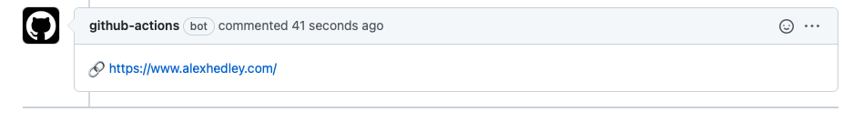

Have you ever needed to add a comment to your PR after your Jobs(s) have completed?

Scrolling through the logs can be long winded, why not add a nice comment?

Want to add some some cool emojis too?

- [emoji-cheat-sheet](https://github.com/ikatyang/emoji-cheat-sheet/blob/master/README.md)

  - 🔗 `:link:`
  - 📘 `:blue_book:`
  - etc

Start with the [actions/github-script](https://github.com/actions/github-script) action.

It has various features, one of which is to `createComment`.

Add the various inputs you need to configure:

`github.issues.createComment({})`

The `body` is the piece you want to update with your info

`body: ':link: MY LINK'`

With an output of

> 🔗 MY LINK

Then you can set your trigger to run on a *PR* and it'll add the necessary info.



---

## Workflow

```yml
name: Add Comment

on:
  # workflow_dispatch:
  pull_request:
    branches: [main]

jobs:
  PR-Comment:
    runs-on: ubuntu-latest
    steps:
      - name: PR Comment
        if: github.base_ref == 'main'
        uses: actions/github-script@v2
        with:
          github-token: ${{secrets.GITHUB_TOKEN}}
          script: |
            github.issues.createComment({
              issue_number: ${{ github.event.number }},
              owner: context.repo.owner,
              repo: context.repo.repo,
              body: ':link: MY LINK'
            })
```
