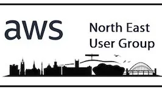

<!-- # AWS User Group - North East - Meetup - Feb 2025 -->

AWS Community re:Invent re:Cap

📅 Wednesday, Feb 12, 2025 · 6pm - 8pm GMT

📍 The Core, Bath Lane, Newcastle Helix, Newcastle upon Tyne, NE4 5TF

🔗 https://www.meetup.com/aws-user-group-north-east-england/events/305592946/

<!--  -->

## Agenda

Hi everyone

Welcome to our first scheduled event of the new year.

The tour has already kicked off and with almost 20 venues in the UK over the next couple of months **Matheus Guimaraes** will be hosting the re:Invent Recap.

If you've missed it completely, or went and still missed things (entirely possibly, its huge!), or want a recap of all the major announcements then come and join us.

Matheus is an entertaining speaker and you'll definitely have a good night.

There will be our usual pizza and drinks provided by our wonderful hosts **Leighton**.

Date: Wednesday February 12  
Time: 18:00-20:00  
Venue: The Core, Bath Lane, Newcastle Helix, Newcastle upon Tyne, NE4 5TF  

Many thanks to our sponsors **Leighton** for hosting us on the night.

Hope to see you all there!

## Notes

Matheus was a superb presenter, really engaging and loved the enthusiasm for all things AWS!

- https://linktr.ee/codingmatheus

## 🔗 Links

- https://www.meetup.com/aws-user-group-north-east-england/
- https://aws.amazon.com/developer/community/usergroups/

A few links I remembered to scan during

- [Announcing a visual update to the AWS Management Console (preview)](https://aws.amazon.com/blogs/aws/announcing-a-visual-update-to-the-aws-management-console-preview/)
- [Use your on-premises infrastructure in Amazon EKS clusters with Amazon EKS Hybrid Nodes](https://aws.amazon.com/blogs/aws/use-your-on-premises-infrastructure-in-amazon-eks-clusters-with-amazon-eks-hybrid-nodes/)
- [New AWS Security Incident Response helps organizations respond to and recover from security events](https://aws.amazon.com/blogs/aws/new-aws-security-incident-response-helps-organizations-respond-to-and-recover-from-security-events/)

Download the PDF to see the full presentation

- [AWS Community re:Invent re:Caps](https://community.aws/recaps)
