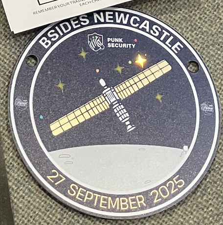
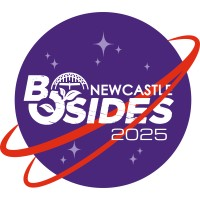

<!-- # BSides Newcastle 2025 -->

<!--  -->

<!--  -->

## Notes

Such a cool badge from the sponsor [Punk Security](https://punksecurity.co.uk).

Great selection of food and drinks, Greggs did a lovely spread.

## Details

📅 Saturday, September 27th, 2025 · 09:30 BST - 18:00 BST

📍 North East Futures UTC, Stephenson Square Newcastle upon Tyne NE1 3AS

🔗 https://www.eventbrite.co.uk/e/bsides-newcastle-bsidesncl-2025-tickets-1415843178059

💷 £15.19

## My Choices

|  |   | Track |
|--|--|--|
| 09:00 | Registration in Lobby & Sponsor Hall Opens. Villages and Sticker Stalls now open. |  |
| 09:30-9:45 | Opening Remarks - BONCL Team |  |
| 09:45-10:25 | Keynote - Dave Lodge: Tautology: From Sputnik to James Webb: satellite comms (and security?) | T1 |
| 10:30-11:00 | Anthony Fielding: An Expedition to Planet Malware | T1 |
| 11:05-11:35 | Fraser Wilson: The Weird and Wonderful Ways of Messing with IoT: Unconventional Attack Vectors on IoT Devices | T3 |
| 11:35-11:55 | _Pastries Break_ |  |
| 11:55-12:25 | Ben Docherty: 3D Printing, innit. | T2 |
| 12:30-13:00 | Jerry Gamblin: CVE Crisis: State of the Vulnerability Disclosure Landscape | T1 |
| 13:00-13:30 | _Lunch_ |  |
| 13:30-14:10 | Munchnote - Christine Smoley: A Cognitive Kill Chain: The Psychological Impact of LLMs | T1 |
| 14:15-14:45 | Workshop: Lego Serious Play for Cyber Security and Infosec | T4 |
| 14:50-15:20 | Workshop: Lego Serious Play for Cyber Security and Infosec | T4 |
| 15:20-15:40 | _Break_ |  |
| 15:40-16:10 | Workshop: Continued: Lego Serious Play for Cyber Security and Infosec | T4 |
| 16:15-16:45 | Simon Painter: Hack the Planet! What Movies can Teach Us about InfoSec | T2 |
| 16:50-17:05 | Tinfoil Space Hats Competition and Teach Me Something | T1 |
| 17:10-17:50 |  |  |
| 17:50-18:00 |  |  |
| 18:00 | Tear Down, Clean Up + Bugger off to the Pub - City Tavern |  |

1st -   
2nd - `--ignore-scripts` `--foreground-scripts` antfie.com [boncl_2025_mw_talk.pdf](docs/bsides/boncl_2025_mw_talk.pdf)  
3rd - Lasers  
4th - Octoprint, Mainsail, KIAUH  
5th - CTI  
6th - May, Toronto Uni, Godfather of AI, Schemata (? https://www.utoronto.ca/news/geoffrey-hinton-discusses-promise-and-perils-ai-toronto-tech-week)  
7th - Knowledge ≠ Understanding  

TODO: add more notes...

## Schedule

### Track 1 Schedule

| | Track 1 |
|-|-|
| 09:00 | Registration in Lobby & Sponsor Hall Opens. Villages and Sticker Stalls now open. |
| 09:30-9:45 | Opening Remarks - BONCL Team |
| 09:45-10:25| Keynote - Dave Lodge: Tautology: From Sputnik to James Webb: satellite comms (and security?) |
| 10:30-11:00 | Anthony Fielding: An Expedition to Planet Malware |
| 11:05-11:35 | \<redacted\>: STS-27 was—and remains—a secret mission |
| 11:35-11:55 | _Pastries Break_ |
| 11:55-12:25 | Donna Goddard: Insider Risk, Myths and Misconceptions |
| 12:30-13:00 | Jerry Gamblin: CVE Crisis: State of the Vulnerability Disclosure Landscape |
| 13:00-13:30 | _Lunch_ |
| 13:30-14:10 | Munchnote - Christine Smoley: A Cognitive Kill Chain: The Psychological Impact of LLMs |
| 14:15-14:45 | Kinga Kaiserin: My LinkedIn Profile Picture is a Deepfake - and Yours Should Be, Too. |
| 14:50-15:20 | Meletius Mgbeodichimma Igbokwe: ChatGPT Taught Me How to Hack! AI as Adversary, Accomplice, and Instructor |
| 15:20-15:40 | _Break_ |
| 15:40-16:10 | Gerald Benischke: What will go wrong when ZAP is driven by GenAI |
| 16:15-16:45 | Jason Halley: Trains: Built from Disaster |
| 16:50-17:05 | Tinfoil Space Hats Competition and Teach Me Something |
| 17:10-17:50 | Locknote - Kat Fitzgerald: Oops, I Clouded Again: Misconfigurations, Mayhem, and the Mistakes We Keep Making |
| 17:50-18:00 | Closing Remarks - BONCL Team |
| 18:00 | Tear Down, Clean Up + Bugger off to the Pub - City Tavern |

#### Keynote - Dave Lodge: Tautology: From Sputnik to James Webb: satellite comms (and security?)

When Sputnik’s simple beep-beep was picked up around the world, it proved two things: satellites work, and everyone can hear them. Since then, space has become our ultimate communications backbone — from meteorological satellites telling us whether to pack an umbrella, to GNSS guiding everything from Uber rides to military drones, to space telescopes streaming cosmic data back to Earth. This talk takes a guided tour through the satellite communications timeline. Along the way we’ll look at the strange, sometimes shaky, relationship between innovation and security in orbit. How anybody with the right equipment can communicate with equipment in space? Why GPS spoofing is such a big problem? And how do we fix bugs on a satellite that is billions of miles away?

#### Anthony Fielding: An Expedition to Planet Malware

I’ve just transitioned from AppSec to malware research and already I’ve seen enough awful stuff to deliver a talk on which I think will be interesting for the audience. My presentation and delivery style is fun, interactive and quirky. The talk will be suitable for all. Includes technical stuff too.

#### \<redacted\>: STS-27 was—and remains—a secret mission

_Top Secret_

#### Donna Goddard: Insider Risk, Myths and Misconceptions

Insider risk can be the biggest risk for an organisation, yet it is often dismissed or underestimated. This talk will take the audience through some of the misconceptions & help them gain the knowledge to address it in their own organisation.

#### Jerry Gamblin: CVE Crisis: State of the Vulnerability Disclosure Landscape

The vulnerability disclosure ecosystem is strained. NVD backlogs and CVE instability create chaos for AppSec pros. This talk dissects the crisis, examines emerging global databases, and offers critical insights for navigating the evolving vulnerability management landscape.

#### Munchnote - Christine Smoley: A Cognitive Kill Chain: The Psychological Impact of LLMs

Through a discussion of emerging studies and the literature on both artificial and mortal intelligence, this talk considers the significance and potential consequences of LLM use in regards to human cognition, specifically as a threat to autonomy and critical thought, and defensive countermeasures.

#### Kinga Kaiserin: My LinkedIn Profile Picture is a Deepfake - and Yours Should Be, Too.

Over 90% of deepfakes on the Internet today have nothing to do with fake news, foreign propaganda or celebrity memes. Learn how threat actors exploit easily accessible AI tools, the surprising legal gaps, and practical strategies to protect yourself, your family and your employees.

#### Meletius Mgbeodichimma Igbokwe: ChatGPT Taught Me How to Hack! AI as Adversary, Accomplice, and Instructor

AI isn’t just helping us secure systems it’s teaching attackers how to break them. This talk exposes how LLMs like ChatGPT are being used to discover exploits, craft attacks, and bypass controls. See how AI is shaping a new generation of threats and how to fight back.

#### Gerald Benischke: What will go wrong when ZAP is driven by GenAI

So there I was, I thought cool, cool, I can take the ZAP OpenAI spec, feed it into FastMCP and now the LLM knows how to do ZAP testing. Sit back and watch the bounties roll in? Well, not quite. Watch me trying to do that live. And probably fall over. Should be entertaining.

#### Jason Halley: Trains: Built from Disaster

How many will come to BSidesNCL by train? Trains are 22 times safter than cars. Getting here has come at a cost, every incident has brought new standards to make trains safer than ever. In this talk I'll review events of the past & how they've got us closer than ever to the 'perfect' safe system.

#### Locknote - Kat Fitzgerald: Oops, I Clouded Again: Misconfigurations, Mayhem, and the Mistakes We Keep Making

Cloud misconfigurations are still the #1 cause of breaches—and attackers are getting faster. This talk walks through real-world examples, recorded demos, and open-source fixes. You’ll laugh, you’ll cringe, and you’ll leave with tools to secure your own cloud chaos.

### Track 2 Schedule

|  | Track 2  |
|--|--|
| 09:00 | Registration in Lobby & Sponsor Hall Opens. Villages and Sticker Stalls now open. |
| 09:30-9:45 | Opening Remarks - BONCL Team |
| 09:45-10:25 |  |
| 10:30-11:00 | Donnan Mallon: Do Or Do Not: The Ramification Of Misinformation |
| 11:05-11:35 | Marcus Tenorio: Open Source and CVE's: A Love Story? |
| 11:35-11:55 | _Pastries Break_ |
| 11:55-12:25 | Ben Docherty: 3D Printing, innit. |
| 12:30-13:00 | Kat Fitzgerald: Going Solo: Thriving as a Single Professional in Cybersecurity |
| 13:00-13:30 | _Lunch_ |
| 13:30-14:10 |  |
| 14:15-14:45 | Liam McGrath: Rage against the machine(s) - An Intro to Operational Technology (OT) Hacking |
| 14:50-15:20 | Dr Clive King: So you want to Launder Money? |
| 15:20-15:40 | _Break_ |
| 15:40-16:10 | Jordan Powell: Cyber Cat & Mouse: Law Enforcement vs The Dark Web |
| 16:15-16:45 | Simon Painter: Hack the Planet! What Movies can Teach Us about InfoSec |
| 16:50-17:05 |  |
| 17:10-17:50 |  |
| 17:50-18:00 |  |
| 18:00 | Tear Down, Clean Up + Bugger off to the Pub - City Tavern |

#### Donnan Mallon: Do Or Do Not: The Ramification Of Misinformation

You know star wars right? How it was inspired by the Vietnam war? Well this talk isn't about that (sort of). We live in an age where information is abused and leveraged through various means, those means includes the threat landscape. Let's dive into the ramifications of misinformation!

#### Marcus Tenorio: Open Source and CVE's: A Love Story?

When we think of Open Source and CVEs, only bad things come to mind: problems and headaches. But what if I told you that’s not the case? That OSS and CVEs form one of the greatest love stories humanity has ever known. Forget Romeo and Juliet; think Log4J and other "love tales".

#### Ben Docherty: 3D Printing, innit.

From humble desk organisers to chaotic robot builds, this is a whirlwind retrospective of seven years deep in the 3D printing rabbit hole. With around ten printers (give or take), countless masks, RC cars, and firmware battles, Ben shares the lessons learned, the mistakes made, and the weird stuff that somehow worked. A journey from design to debugging—with plenty of melted plastic and a dash of blame for David.

#### Kat Fitzgerald: Going Solo: Thriving as a Single Professional in Cybersecurity

Burnout advice in security often assumes you’ve got a spouse and kids. But what if you don’t? This talk is for the solo crew, the ones always on call, flying solo, and still told they’re lucky. Let’s rewrite the narrative and build secure boundaries for a party of one! ok, plus my cat(s)

#### Liam McGrath: Rage against the machine(s) - An Intro to Operational Technology (OT) Hacking

An intro to OT pentesting, explore how we safely conduct OT pentests in high-risk environments both on the ground and with simulation. Includes lessons learned and a case study where we took over robotic arms and an assembly line in two South African factories - without downtime.

#### Dr Clive King: So you want to Launder Money?

Money Laundering is an essential enabler for much of Cybercrime. Understanding how money gets moved and cleaned can help guide our own OPSEC, as an individual or Individual Contributor in an organisation, to make it harder for our money to disappear without trace?

#### Jordan Powell: Cyber Cat & Mouse: Law Enforcement vs The Dark Web

This talk will introduce the Dark Web and identify Law Enforcement (LE) challenges. The talk will also discuss my dissertation project VoidCore a Tor-based CtF to provide a training solution for LE identifying common themes in past attacks against Tor domains.

#### Simon Painter: Hack the Planet! What Movies can Teach Us about InfoSec

A light & amusing talk about fundamental info-sec principles applicable to any business, but told using Hollywood films, like a terrible password having scene in Batman & Robin, or Jurassic Park and it's lack of a disaster recovery plan. Other films include Hackers & The Net

### Track 3 Schedule

| | Track 3 |
|-|-|
| 09:00 | Registration in Lobby & Sponsor Hall Opens. Villages and Sticker Stalls now open. |
| 09:30-9:45 | Opening Remarks - BONCL Team |
| 09:45-10:25 | Fraser Wilson: The Weird and Wonderful Ways of Messing with IoT: Unconventional Attack Vectors on IoT Devices |
| 10:30-11:00 |  |
| 11:05-11:35 |  |
| 11:35-11:55 | _Pastries Break_ |
| 11:55-12:25 | Sam Macdonald: So You Want To Be A Hacker? |
| 12:30-13:00 | Phani Suresh Paladugu: Silent Channels, Loud Risks: Securing SerDes in AI Hardware Interconnects |
| 13:00-13:30 | _Lunch_ |
| 13:30-14:10 |  |
| 14:15-14:45 | Avidan Avraham: Contextual Agentic Garbage Collector: Sweeping Up Misconfiguration Crumbs Before Attackers Do |
| 14:50-15:20 | Callum Thomson: How To Pwn A Zune |
| 15:20-15:40 | _Break_ |
| 15:40-16:10 | Innocent Paul Ojo: Breaking In Without Burning Out: Lessons from Hacking, Learning, and Starting a Cybersecurity Career |
| 16:15-16:45 | Tin Foil Space Hats Making |
| 16:50-17:05 |  |
| 17:10-17:50 |  |
| 17:50-18:00 | Closing Remarks - BONCL Team |
| 18:00 | Tear Down, Clean Up + Bugger off to the Pub - City Tavern |

#### Fraser Wilson: The Weird and Wonderful Ways of Messing with IoT: Unconventional Attack Vectors on IoT Devices

IoT devices are all around us creating new attack surfaces, and their nature and location opens up weird and wacky ways of exploiting them from lasers and electromagnets to grey noise. Why just focus on boring old conventional attacks when you can take a romp through the world of weird alternatives?

#### Sam Macdonald: So You Want To Be A Hacker?

Popping shells is fun! Until you’re buried in scoping calls, documentation, and writing reports no one wants to read (but everyone depends on). This talk pulls back the curtain on pen testing, the hacks, the headaches, and the stuff social media forgets to mention.

#### Phani Suresh Paladugu: Silent Channels, Loud Risks: Securing SerDes in AI Hardware Interconnects

SerDes is fast, invisible and often insecure. This talk exposes how AI hardware interconnects can become attack vectors via signal anomalies, side-channels, and fault injection. Learn how to secure the silent links behind large-scale AI compute.

#### Avidan Avraham: Contextual Agentic Garbage Collector: Sweeping Up Misconfiguration Crumbs Before Attackers Do

Learn how AI is uncovering hidden security risks in the comments and notes of your policies stuff most tools miss. It’s like having a smart cleanup crew that spots trouble before it turns into a real problem.

#### Callum Thomson: How To Pwn A Zune

I'll show how and why I hacked the Microsoft Zune. I'll show my process as I hunt for bugs, and show how I bypassed the mitigations in place and developed a one-click exploit chain that can be used to dump the encrypted apps so they can be preserved.

#### Innocent Paul Ojo: Breaking In Without Burning Out: Lessons from Hacking, Learning, and Starting a Cybersecurity Career

Breaking into cybersecurity can feel overwhelming. In this uplifting talk, I’ll share how I went from self-learning to securing real systems, demystifying career entry, imposter syndrome, and the power of curiosity, mentorship, and failure.

### Workshop Schedule

|  | Track 4/Workshop |
|--|--|
| 09:00 | Registration in Lobby & Sponsor Hall Opens. Villages and Sticker Stalls now open. |
| 09:30-9:45 | Opening Remarks - BONCL Team |
| 09:45-10:25 |  |
| 10:30-11:00 | Teach me something |
| 11:05-11:35 | Teach me something |
| 11:35-11:55 | _Pastries Break_ |
| 11:55-12:25 | Tin Foil Space Hats Making |
| 12:30-13:00 | Tin Foil Space Hats Making |
| 13:00-13:30 | _Lunch_ |
| 13:30-14:10 |  |
| 14:15-14:45 | Workshop: Lego Serious Play for Cyber Security and Infosec |
| 14:50-15:20 | Workshop: Lego Serious Play for Cyber Security and Infosec |
| 15:20-15:40 | _Break_ |
| 15:40-16:10 | Workshop: Continued: Lego Serious Play for Cyber Security and Infosec |
| 16:15-16:45 |  |
| 16:50-17:05 |  |
| 17:10-17:50 |  |
| 17:50-18:00 |  |
| 18:00 | Tear Down, Clean Up + Bugger off to the Pub - City Tavern |

#### Teach me something

Got a weird trick, a niche skill, or a mind-blowing fact? This is your moment. Step up, drop some knowledge, and dazzle the crowd. Whether it's crypto, cooking, or cat psychology—anything goes. The most captivating lesson wins a prize and eternal bragging rights.

#### Tin Foil Space Hats Making

Channel your inner conspiracy theorist or intergalactic fashionista. In this hands-on session, we’ll sculpt shimmering headgear worthy of alien diplomacy, satellite evasion, or just pure chaotic creativity. Materials provided. Style points awarded. Cosmic vibes guaranteed.

#### Philip Veal: Lego Serious Play for Cyber Security and Infosec

Cyber security is a constantly evolving discipline involving numerous threats and actors. We are often told to "think differently" or to "be innovative' about any scenario we face. This workshop will equip with methods you to do just that - all while having fun.

- https://www.linkedin.com/in/dr-philip-veal/
- https://www.silbo.co.uk  

---

## About us

Welcome to BSides Newcastle, a vibrant security conference designed by and for the InfoSec community. Here we unite enthusiasts, professionals, and experts eager to share their knowledge and insights in a friendly and supportive atmosphere. Whether you are taking your first steps into the field or are a seasoned pro, BSides Newcastle offers a wealth of opportunities for everyone passionate about security. Join us for engaging discussions, skill-building workshops, and the chance to expand your network in an inclusive setting where everyone’s voice matters.

Fresh out of the oven! For just £15.19 you can treat yourself to a T-shirt if you get your ticket by the 10/09/25 and a catered meal. In a city! Oh and there's a security conference. About space!

If you have the privilege of being in a position to purchase a donate-a-ticket, you'll be providing the same gifts to someone else! Gifted tickets will be offered to educational groups and institutions, as well as people who may otherwise be unable to attend. You kind, beautiful human/nonhuman you <3

## Docs

- [Programme](docs/bsides/bsides_newcastle_2025.pdf "Programme") PDF

## 🔗 Links

- https://www.bsidesnewcastle.org/
- https://x.com/bsidesncl
- https://uk.linkedin.com/company/bsidesncl
- https://discord.gg/YVwnpgFZ2e
- https://bsky.app/profile/bsidesncl.bsky.social
 
- https://www.eventbrite.co.uk/e/bsides-newcastle-bsidesncl-2025-tickets-1415843178059
