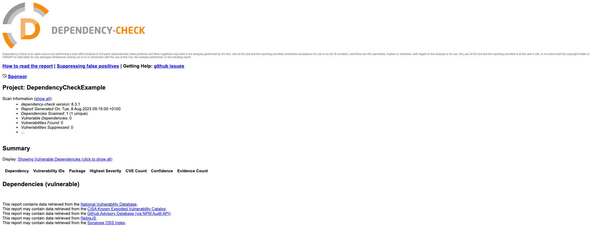
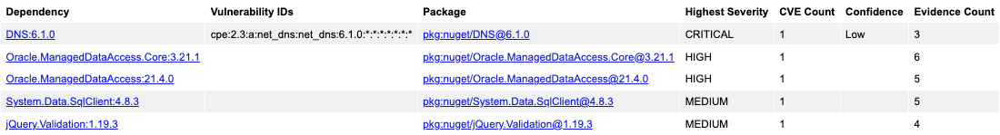
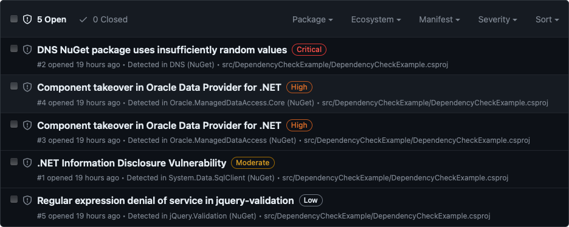

<!-- DependencyCheck .NET -->

In this article I will run through setting up the awesome [DependencyCheck](https://jeremylong.github.io/DependencyCheck/index.html) from [Jeremy Long](https://github.com/jeremylong) for a .NET application.

> Dependency-check can currently be used to scan software to identify the use of known vulnerable components.

I've used this on some Kotlin/Java projects and wanted to see how easy it was to setup for .NET.

There are a number of plugins listed for Gradle etc but for .NET I'm going to use the [CLI](https://jeremylong.github.io/DependencyCheck/dependency-check-cli/index.html).

You can run this locally, first install with `brew install dependency-check` then for ***nix** systems run `dependency-check.sh --project "My App Name" --scan "/java/application/lib"`.

Since I'm wanting to also try this out in CI/CD it's straight to GitHub to create a sample repo.

- [dotnet-dependencycheck](https://github.com/alex-hedley/dotnet-dependencycheck)

I created a simple .NET Console Application then looked at what was needed to run the tooling locally.

`dependency-check --project "DependencyCheckExample" --scan "src/DependencyCheckExample/bin/Debug/net7.0/*.dll"`

> [NOTE] Update the `net7.0` version to whichever you are working with.

Depending where you are running the tool from determines the output location of the report. See the [Command Line Agruments](https://jeremylong.github.io/DependencyCheck/dependency-check-cli/arguments.html) for more details.

| Short | Argument Name | Parameter | Description | Requirement |
|-|-|-|-|-|
| `-o` | `--out` | `<path>` | The folder to write reports to. This defaults to the current directory. If the format is not set to ALL one could specify a specific file name. | Optional |

Make sure you are in the working directory of your project before running, unless you want it adding to your _usr_ folder.

I also updated it to output to a subfolder of _reports_.

`dependency-check --project "DependencyCheckExample" --scan "DependencyCheckExample/bin/Debug/net7.0/*.dll" --out "reports"`

This produces a `dependency-check-report.html` file, self contained with the results.



Not very interesting as there are no dependencies, but at least the flow is working.

Next is how to replicate this in [GitHub Actions](https://github.com/features/actions)?

Could I run `brew install` and run `dependency-check.sh`, maybe but I'm sure someone has already created a GitHub Action for this.

- [Dependency-Check Action](https://github.com/dependency-check/Dependency-Check_Action)

```yml
      - name: Depcheck
        uses: dependency-check/Dependency-Check_Action@main
        id: Depcheck
        with:
          project: 'test'
          path: '.'
          format: 'HTML'
          out: 'reports' # this is the default, no need to specify unless you wish to override it
          args: >
            --failOnCVSS 7
            --enableRetired
```

This has a lot of options to override so check the docs if you want to tweak anything.

There's an ADO one too ([azuredevops](https://github.com/dependency-check/azuredevops)).

I created a Workflow ([depcheck.yml](https://github.com/alex-hedley/dotnet-dependencycheck/blob/main/.github/workflows/depcheck.yml)) to get the _src_, _restore_ any dependencies, _build_, (_test_) and then run the **Dependency-Check action**.

We now have an artifact so might as well upload that and since it's a website we can use GitHub Pages to host the output too.

I manually created an `index.html` on the `gh-pages` branch to point to the file, you could do with this how you wish.

I've used [JamesIves/github-pages-deploy-action](https://github.com/JamesIves/github-pages-deploy-action) but you could swap to [peaceiris/actions-gh-pages](https://github.com/peaceiris/actions-gh-pages) or even the GH one through the new Beta options which includes `actions/configure-pages`, `actions/upload-pages-artifact` and `actions/deploy-pages`.

Next up is adding some vulnerable code to the sample Console App to see what DC finds...

## Vulnerabilities

First thing to do is find some...

I could take a look through the CVEs on [https://cve.mitre.org](https://cve.mitre.org) but it would help to know the CVE #. Another option is to filter the [GitHub Advisory Database](https://github.com/advisories) for [NuGet](https://www.nuget.org).

- [https://github.com/advisories?query=type%3Areviewed+ecosystem%3Anuget](https://github.com/advisories?query=type%3Areviewed+ecosystem%3Anuget)

I can then filter by Severity to get an example of each kind.

- 🟥 Critical - [CVE-2021-4248](https://github.com/advisories/GHSA-g3wc-xv93-445q) - DNS NuGet package uses insufficiently random values (DNS (6.1.0))
- 🟧 High - [CVE-2023-21893](https://github.com/advisories/GHSA-5pm2-9mr2-3frq) - Component takeover in Oracle Data Provider for .NET (Oracle.ManagedDataAccess (21.4.0) / Oracle.ManagedDataAccess.Core (3.21.1))
- 🟨 Moderate - [CVE-2022-41064](https://github.com/advisories/GHSA-8g2p-5pqh-5jmc) - .NET Information Disclosure Vulnerability (System.Data.SqlClient (4.8.3))
- ⬜️ Low - [CVE-2021-43306](https://github.com/advisories/GHSA-j9m2-h2pv-wvph) - Regular expression denial of service in jquery-validation (jQuery.Validation (1.19.3))

Add these to my `.csproj`, rebuild and then re-run the DC tool.



Comparing this to GitHub's check you can also see the same list from the Security tab (Dependabot):

- https://github.com/alex-hedley/dotnet-dependencycheck/security



## Suppressions

As with everything we want a way to ignore things, these being false positive vulnerabilities or ones we've chosen to ignore for whatever reason. There is an option to do this with a supplementary file.

Create a new xml file, e.g. `dependency-suppression.xml` and add the following:

```xml
<?xml version="1.0" encoding="UTF-8"?>
<suppressions xmlns="https://jeremylong.github.io/DependencyCheck/dependency-suppression.1.3.xsd">
</suppressions>
```

Then in the Dependency Check Report there is a _suppress_ button containing the XML you need to add, click, copy and add e.g.

```xml
    <suppress>
        <notes><![CDATA[
        file name: Microsoft.Win32.SystemEvents.dll
        ]]></notes>
        <packageUrl regex="true">^pkg:generic/Microsoft\.Win32\.SystemEvents@.*$</packageUrl>
        <cpe>cpe:/a:microsoft:.net_core</cpe>
    </suppress>
```

Re-run the report and this will have gone.

## Fail

From the sample there was an added arg of `failOnCVSS` set to **7** so this was failing the CI/CD, as expected:

```bash
Error:

One or more dependencies were identified with vulnerabilities that have a CVSS score greater than or equal to '7.0': 

DependencyCheckExample.csproj: CVE-2021-4248(9.8)
DependencyCheckExample.csproj: CVE-2023-21893(7.5)
DependencyCheckExample.csproj: CVE-2023-21893(7.5)
```

Removing this didn't stop the build failing and I couldn't see a default value in the code. Looking at the check [CliParser - getFailOnCVSS](https://github.com/jeremylong/DependencyCheck/blob/6a85d0ffa28d6e625f3ef23db766f651614ad505/cli/src/main/java/org/owasp/dependencycheck/CliParser.java#L906) I found it defaulted to **11** so just overrode it for the time being as I wanted the build to pass and produce the report - in a real world situation it would be good to set this to the required limit.

```yml
        args: >
            --failOnCVSS 11
```

- [Command Line Arguments](https://jeremylong.github.io/DependencyCheck/dependency-check-cli/arguments.html)

| Short | Argument Name | Parameter | Description | Requirement |
|-|-|-|-|-|
| | `--failOnCVSS` | `<score>` | If the score set between 0 and 10 the exit code from dependency-check will indicate if a vulnerability with a CVSS score equal to or higher was identified. | Optional |

## Inconsistencies

Running the app locally doesn't produce the same output as on GitHub Actions...

`dependency-check --v`

> Dependency-Check Core version 8.3.1

The [Dependency-Check Action](https://github.com/dependency-check/Dependency-Check_Action) uses the [DependencyCheck Builder](https://github.com/dependency-check/DependencyCheck_Builder/) which has a [Dockerfile](https://github.com/dependency-check/DependencyCheck_Builder/blob/main/Dockerfile) which uses the [Docker Hub image](https://hub.docker.com/r/owasp/dependency-check) which is currently the same version.

`--enableRetired` is being used in the GHA but I'm not locally.

I need to check if any other args are being set to a default value.
