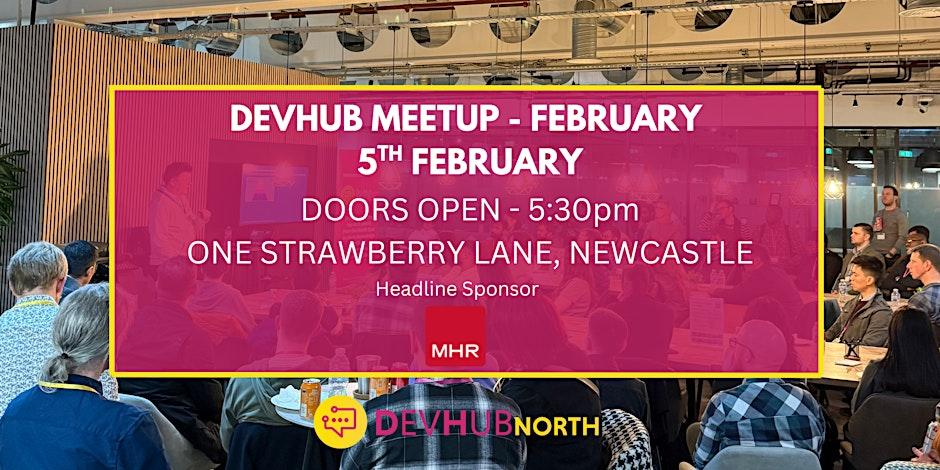

<!-- # Devhub North - February -->

<!--  -->

📅 Thursday, Feb 5 from 5:30 pm to 8 pm GMT

📍 One Strawberry LaneNewcastle upon Tyne, England

🔗 https://www.eventbrite.co.uk/e/devhub-north-february-tickets-1979864131915

## Overview

DevHub North is the North's biggest developer community! Join us to network and talk all things tech :)
We’re back with another exciting DevHub North in-person event at a brand new location, One Strawberry Lane, Newcastle - and once again, we’re proudly sponsored by MHR!

📅 Date: Thursday 5th February  
🕠 Time: Doors open at 5:30pm  
📍 Location: One Strawberry Lane, Newcastle  

Whether you’re a developer, a tech professional, a student, or just someone who’s fascinated by technology, you’re invited to join us for an evening of learning, networking, and (of course) pizza and beers.

**About our sponsor: MHR**

MHR is a global leader in HR, payroll, and analytics solutions, helping organisations transform the way they work. With innovation at their core, they’ve been empowering businesses to streamline operations, enhance employee experiences, and embrace the future of work for over 40 years. They’re not just backing this event - they’re sharing their own journey of transformation, design excellence, and AI-driven development through our speaker sessions.

**What to expect:**

- Inspiring talks from industry experts (see below!)
- Networking with like-minded professionals
- Free pizza, beers, and soft drinks
- Knowledge sharing in a friendly, open community
- Lanyards to make meeting new people even easier

### Our Speakers:

**Welcome & Company Introduction**  
Presented by: Rosie (Host)

**1. Talk One – Emerging patterns for use with LLM's**  
Presented by: Mark Williams (Director of Innovation)

**2. Talk Two - Creating generative UI with LLM's**  
Presented by: Anthony Porthouse (Senior Web Application Developer)

Don’t miss it!

Spaces fill up quickly, so register now to secure your lanyard and your spot for an evening of inspiration, connection, and great conversation.

We can’t wait to see you there 👋

Your DevHub North Team 💬

---

Good to know

Highlights

🕰️ 2 hours 30 minutes  
📍 In person
