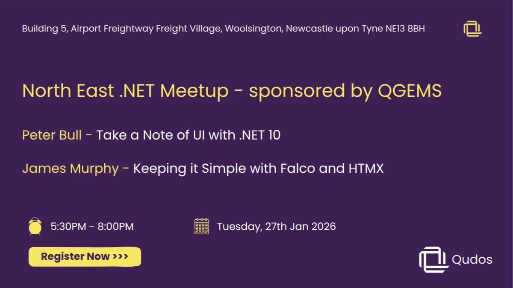

<!-- # Qudos .NET Newcastle Meetup - Jan 2026 -->

📅 Tuesday, Jan 27, 2025 · 5:30 - 8pm GMT

📍 Building 5, Airport Freightway Freight Village, Woolsington, Newcastle upon Tyne NE13 8BH · Newcastle upon Tyne

🔗 https://www.meetup.com/dotnetmeetupnorth/events/312759966/

For our first 2 meetups in 2026, the folks over at **QGEMS** have kindly offered to host and sponsor.

We will be at **Building 5, Airport Freightway Freight Village, Woolsington, Newcastle upon Tyne NE13 8BH** - plenty of free parking on site and a short walk from the nearest Metro.

We have a fairly relaxed agenda, but will follow:

5:30 - Doors Open  
5:45 - Pizza arrival  
6:00 - Introduction / Housekeeping  
6:10 - Talks begin  
8:00 - Closing  

Who should attend:

Beginners and experienced .NET developers, architects, cloud engineers, and anyone curious about building smarter, AI-enhanced applications with Microsoft technologies.

**Speaker 1:** Peter Bull

**Title:** Take a Note of UI with .NET 10

**Description:**

Take a Note of UI with .NET 10 is an ambitious whistle-stop tour through the A to (almost) Z of first-party Microsoft user interface technologies supported in .NET 10 with C# 14 including ASP.NET Core, Blazor, Console, .NET MAUI, Windows, Forms, Windows Presentation Foundation, WinUI with Windows App SDK and more!

See what is possible with .NET 10 and C# 14 using Visual Studio 2026 and how GitHub Copilot accelerated the process of creating the epic notes app demo that features a showcase of first-party UI possible in Windows 11, cross platform and more with Take a Note of UI with .NET 10!

_📼 Video_:

TBA

**Speaker Bio:**

Peter Bull is a senior software engineer at Klipboard and has over 25 years of professional experience and 35 years of personal experience as a programmer. Peter has used every major version of .NET since it began from .NET Framework 1.0 to .NET 10 along with every major version of Visual Studio from Visual Studio 97 to Visual Studio 2026.

Peter is a twice-awarded Microsoft MVP for .NET and Windows thanks to his articles and podcast at rogueplanetoid.com along with tutorials, talks and workshops at tutorialr.com. Peter also has his own open-source packages and upcoming live-streamed course at comentsys.com

**Speaker 2:** James Murphy

**Title:** Keeping it Simple with Falco and HTMX

**Description:**

This is an experience report from developing a small web based utility to solve a specific problem within Footy.com

I'll talk about the tools I chose, why I chose them, how that aligns with keeping it simple.

Bits of F#, HTMX, Aspire, MongoDB, and maybe some other stuff.

_📼 Video_:

TBA

**Speaker Bio:**

James Murphy (Murph) has been attempting to learn to write code for 45 years and feels that given another decade or two he might just get the hang of it...despite this he's managed to earn a living in the software industry for almost 40 years (James’ words not ours!)

## 🔗 Links

- https://www.youtube.com/@QudosRecruitment
- https://www.meetup.com/dotnetmeetupnorth/
- https://www.meetup.com/dotnetmeetupnorth/events/312759966/
