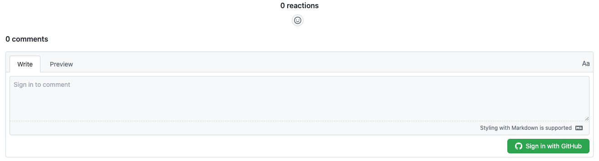
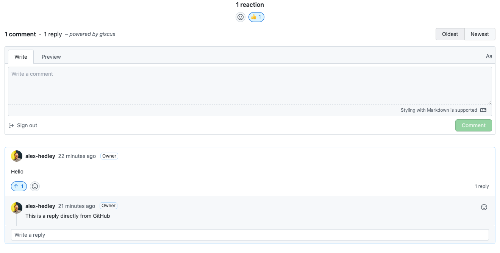
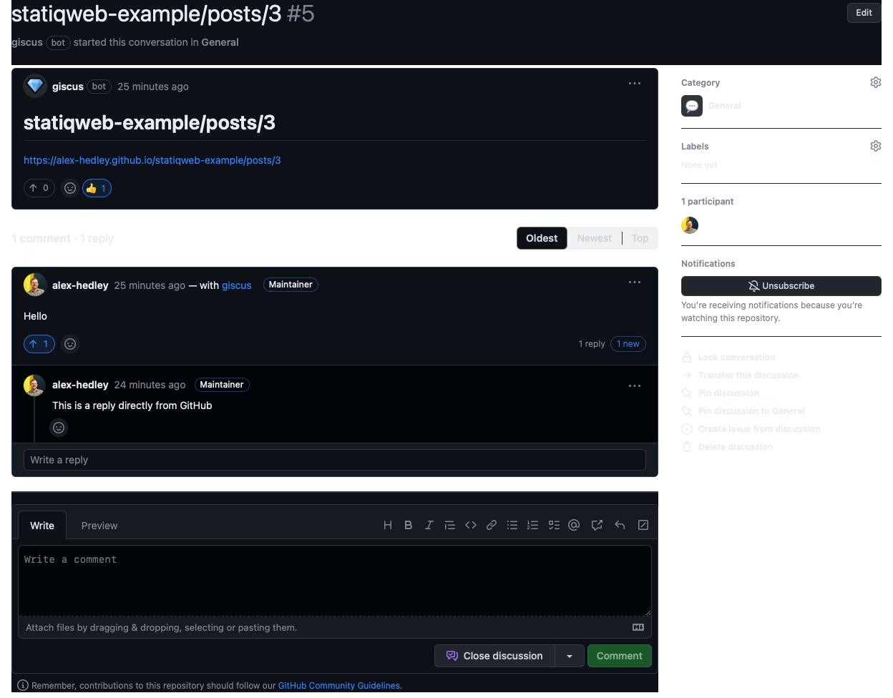

What's the best way to allow commenting on your blog? What better way than to have it contained in the system the blog lives in, [GitHub](https://github.com/). I've seen other solutions in the past which used [GitHub Issues](https://github.com/features/issues) but this doesn't seem the right place for it.

Along comes [giscus](https://giscus.app) which has been built upon it's predecessors.

> [giscus](https://giscus.app) - A comments system powered by [GitHub Discussions](https://docs.github.com/en/discussions). Let visitors leave comments and reactions on your website via GitHub! Heavily inspired by [utterances](https://github.com/utterance/utterances).

In [statiq.web](https://www.statiq.dev/web) there are a couple of ways to achieve this. The simplest one I've found is adding the following to your `appsettings.json`.

```json
{
    "CommentEngine": "giscus",
    "GiscusRepoName": "",
    "GiscusRepoId": "",
    "GiscusCategoryId": ""
}
```

You then need to follow the instructions on [giscus](https://giscus.app) to grab the relevant Ids, but first enable Discussions on your repo. Next select your *Configuration* options then near the end of the page there will be an *Enable giscus* section to grab the above info.

Once you have updated these, just push and wait for the site to redeploy, check on a page and you'll have a option to comment, but first you have to sign in.



Once signed in you can comment:



See the actual post: https://alex-hedley.github.io/statiqweb-example/posts/3

Then directly on GitHub:



Link: https://github.com/alex-hedley/statiqweb-example/discussions/5

As this is live, you can comment in either place and it will be updated.

---

Example: https://github.com/TechWatching/techwatching.dev/blob/main/appsettings.json

---

Another option is to add a `script` tag to the `_post-footer.cshtml` custom page.

Update the `script` tag with the required attributes, taken from the [giscus](https://giscus.app) config page.

One issue with this is that it needs to go in the `theme/input/_post-footer.cshtml` folder.

I have pulled this in as a git submodule so I have tried how to use both. Thankfully the addition to the `appsettings.json` is enough, but if you wanted to change the layout, formatting etc I can see this being useful.

Blog Post: https://beckshome.com/2022/09/beckshome-on-statiq

Example: https://github.com/thbst16/dotnet-statiq-beckshome-blog/blob/main/theme/input/_post-footer.cshtml
