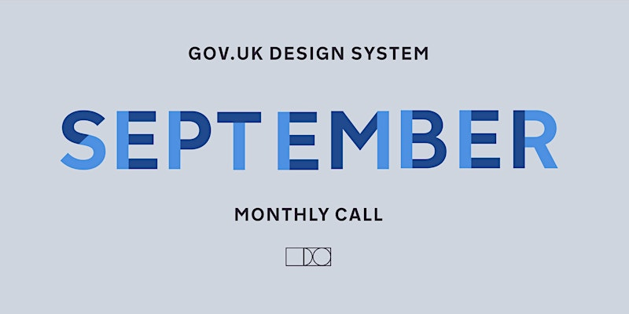

<!-- # Design System Chat - September 2025 -->
<!--  -->

Join us for October 2025's Design System Chat to discuss Service Patterns. Hosted by the GOV.UK Design System.

## Event

🗓️ Wednesday, 5th Nov  
🕰️ 11:00 - 12:00 BST  
📍 Online  
🔗 https://www.eventbrite.co.uk/e/design-system-chat-october-ish-2025-tickets-1867454459559  

## Details

Hello,

You're invited to October 2025's Design System Chat (yes, we know that it is technically November), hosted monthly by the GOV.UK Design System team. We'll be continuing on from last month's discussion about **Service Patterns**.

### Agenda

- Show & tell: Service Patterns in ScotGov - Kirsty Sinclair and Fraser Smith, ScotGov
- Show & tell: Service Patterns in Wales - Adrian Ortega and Liam Collins, CDPS
- Are you working on patterns in your organisation or service?

**Session type:** Workshop/discusssion  
**Duration:** 1 hour  
**Platform:** Microsoft Teams. 

If you sign up, please make sure you can attend the whole session, as we sell out quite quickly.
We will be using **MS Teams** for video, and **Padlet** for notes and comments. Please make sure you have a device that can access these, as some organisation’s firewalls block these platforms.

We hope to see you there!
The GOV.UK Design System team

## Notes

- 

## 🔗 Links

- https://design-system.service.gov.uk
- https://www.youtube.com/@GovernmentDigitalService
- https://www.youtube.com/@UKGovDesign
