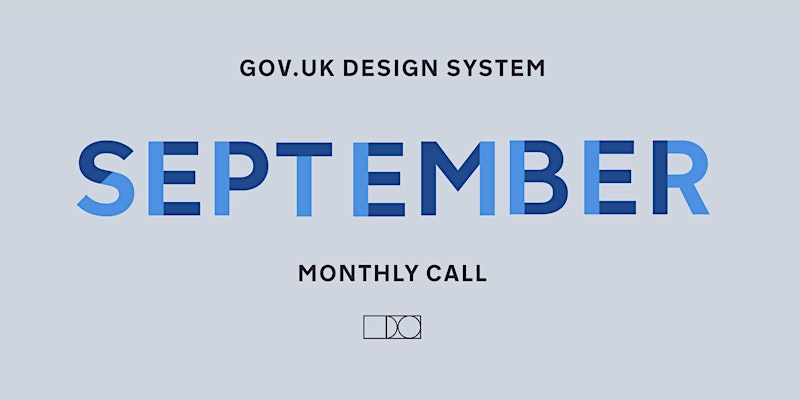

<!-- # Design System Chat - September 2025 -->
<!--  -->

Join us for September 2025's Design System Chat to discuss Service Patterns. Hosted by the GOV.UK Design System.

## Event

🗓️ Tuesday, 30 Sept  
🕰️ 14:00 - 15:00 BST  
📍 Online  
🔗 https://www.eventbrite.co.uk/e/design-system-chat-september-2025-tickets-1679556271019  

## Details

Hello,
You're invited to September 2025's Design System Chat, hosted monthly by the GOV.UK Design System team. We'll be talking about Service Patterns.

### Agenda

- Have you heard the term service pattern? What does it mean to you?
- Show & tell: Service patterns mini-discovery - Imran Hussain, GDS
- Are you working on patterns in your organisation or service?

**Session type:** Workshop/discusssion  
**Duration:** 1 hour  
**Platform:** Zoom meetings  

If you sign up, please make sure you can attend the whole session, as we sell out quite quickly.
We will be using **Zoom** for video, and **Padlet** for notes and comments. Please make sure you have a device that can access these, as some organisation’s firewalls block these platforms.

We hope to see you there!
The GOV.UK Design System team

## Notes

- https://design-system.service.gov.uk/patterns/
- https://design-system.dwp.gov.uk
- https://digitalpublicservices.gov.wales/our-work/service-patterns
  - https://github.com/learnbymakingwales/lbm-prototype-kit
- https://www.tpximpact.com
- https://patterns.wearefuturegov.com/services
- https://govservicedesign.net
- https://www.govstack.global

## 🔗 Links

- https://design-system.service.gov.uk
- https://www.youtube.com/@GovernmentDigitalService
- https://www.youtube.com/@UKGovDesign
