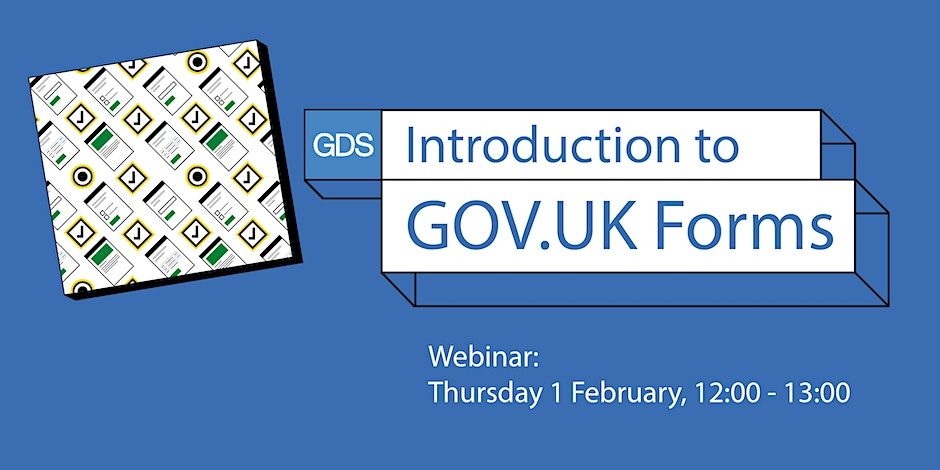

<!-- # Introduction to GOV.UK Forms -->

Find out just how easy it is to create online forms using the Government Digital Service new forms builder.

<!--  -->

## Event

🗓️ Thursday, 1 February 2024  
🕰️ 12:00 - 13:00 GMT  
📍Online  
🔗 https://www.eventbrite.co.uk/e/hyhubs-hyheroes-awards-2023-tickets-727053124467  

## Details

We’ve launched the early access phase of our new form builder software GOV.UK forms.
It helps make the switch from document based and printed forms to easy to use, accessible online forms across government. It’s part of our commitment to make it easier for government departments to build digital services.
We’ve got an array of features already available with more being developed. Join our webinar to find out how simple it is to use and how it's improving the outcomes for the people who complete the forms and the people who process them.

### Agenda

12:00 - 12:10 Introductions  
12:10 - 12:30 Demonstration and latest features  
12:30 - 13:00 Questions from the audience  

## 🔗 Links

- https://www.forms.service.gov.uk
