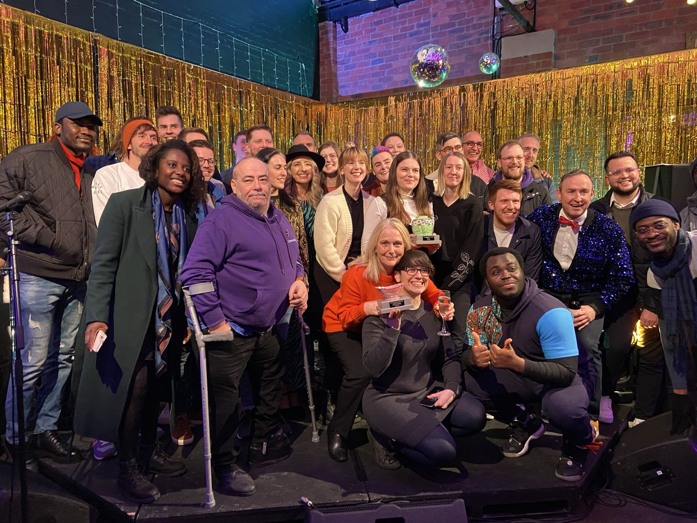

<!-- # HyHubs HyHeroes Awards -->

Tonight was the **HyHubs HyHeroes Awards 2023** with a number of colleagues from the [OC](https://opencastsoftware.com) in the running.

## Event

🗓️ Thursday, 30 November  
📍 Tyne Bank Brewery  
🕰️ 6pm – 11:30pm  
🔗 https://www.eventbrite.co.uk/e/hyhubs-hyheroes-awards-2023-tickets-727053124467  

## Details

An awards evening celebrating the tenants and residents of HyHubs

We are excited to launch the first HyHeroes awards, brought to you by HyHubs and organised by our tenants BeaconHouse Events.

The awards will recognise and celebrate the brilliant people, organisations and initiatives we are proud to have in the HyHubs community.

The awards night is open to residents, tenants, and their friends and family to come along and enjoy the fun. Please book your ticket using the button below. Included in the ticket is food by 2Knives Kitchen, a welcome drink, as well as the awards and of course socialising with all your neighbours within the HyHubs community.

### Best Neighbour

Got a neighbour that brings you treats, visits often or is just a friendly face? The best neighbour award is for the helping hand who goes above and beyond next door, or nearby.

Best Neighbour Finalists:

- Rapid 9
- Proven Goods
- Helen Hornshaw – Cheviot Insured
- Cake Stories
- Hillstar Building Management

### Success Story, Sponsored by Rob Lawson Ltd

What’s your company’s success story? Did you grow unexpectedly, risk it all for overnight success that paid off, or after years hard work finally reaped the rewards, you knew were waiting to be achieved.

Success Story Finalists:

- Northern Standard Mortgages
- 2Knives Kitchen
- Acropolis
- Full Circle Brew Co
- Red Engineering

### Coolest Workspace, Sponsored by HyHubs

Is it pleasure to go work every day to be in the surroundings of your workplace? Is it relaxed and filled with perks and other motivators to keep you at your most productive? What quirky design makes it the funkiest place in town to get the title of Coolest Workspace?

Coolest Workspace Finalists:

- Opencast
- Neighbourhood
- Full Circle Brew Co
- QA Apprenticeships
- High Flyers Tattoo Studio

### Positive Impact

Is there a person, workplace or initiative you feel has positively impacted you, your circle and the community around you? Helped you see things from another outlook and point of few, or opened your mind to new ideas? Tell us about a positive impact which has you feeling lifted.

Positive Impact Finalists:

- DPP Planning
- Dan Pearson – Opencast
- Poleguns
- Karis Jones – Honey Pot Creative Media Ltd
- QA Apprenticeships

### Trend Setter, Sponsored by Aspire

For the company that is paving a new and unique path in their industry. An award for switching it up a bit and moving with the times at a fast and proactive pace.

Trend Setter Finalists:

- Swarm Energy
- Ingram AV
- FYTO
- Design North
- QA Apprenticeships

### Bossing It

Is your boss the boss? Understanding, everything they say makes sense, actively encouraging your growth and career path? Tell us why your boss is simply the best.

Bossing It Finalists:

- Reed – Ingram AV
- Dulcie Hakin – HyHubs
- Glenn Ford – Glenn Ford Private Finance
- Aimee Fife – Hello Education
- Jay – Jaccountancy

### New Kid on the Block

What’s the new kid like? For the best staff member with under 18 months with the company. Have they come in and created a positive whirlwind or upped the game of the whole team. Lets give them the credit they deserve and recognise their achievements.

New Kid on the Block Finalists:

- Alfred Akligo – Opencast
- Sam Roberts – Tapyard Studios
- Liliana Martin – Opencast
- Drew Binnom – Rascals Barbers
- Projekt Architects

The awards night is open to residents, tenants, and their friends and family to come along and enjoy the fun. Please book your ticket using the button below. Included in the ticket is food by 2Knives Kitchen, a welcome drink, as well as the awards and of course socialising with all your neighbours within the HyHubs community.

## Links

- https://hyhubs.com/hyhubs-hyheroes-awards-2023/
- https://hyhubs.com
