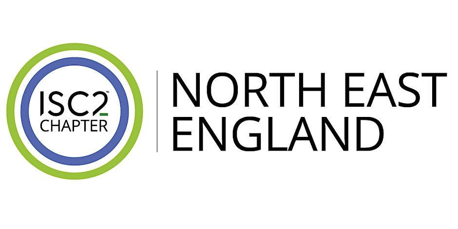

<!-- # ISC2 North East England Chapter June 2026 Meetup -->

<!--  -->

Join ISC2 North East England Chapter this June for an in-person meetup packed with cyber tips and networking!

**ISC2 North East England Chapter Meeting June 2026**

Join us in person for the ISC2 North East England Chapter Meeting this June! It's a fantastic chance to connect with fellow cybersecurity enthusiasts, share ideas, and stay updated on the latest industry trends. Whether you're a pro or just curious, come along for engaging talks and great networking. Don't miss out on this opportunity to grow your knowledge and meet amazing people in the field!

Please note, whilst drinks will be provided we are unable to offer food at this event, apologies.

## Agenda

**Martin Wilson (NEBRC)**

What’s new in the Cyber Resilience Centre Network?

**Brian Collins (RECCC)**

Crime and Fraud in 2026

**Michael Lamb (Cribl)**

Hiring & Interviewing AI Agents for your Security Capability

**Kirk Maddison**

Do we design for auditors or real adversaries?

**Robin Fewster**

How to build a cyber team just using AI.

**Kristina Holt (Foot Anstey)**

Updates on Cyber regulations

**AGM & Update on Chapter Future**

## 🗓️ Date and time

🗓️ Tuesday 16 June  •  6 PM - 9 PM

## 📍 Location

📍 Opencast, Byker, England  
Walker Road  
Byker NE6 2HL

## Highlights

3 hours  
Ages 18+  
In-person  
Free parking  
Doors at 5:30 PM  

## 🔗 Links

- https://www.eventbrite.co.uk/e/isc2-north-east-england-chapter-meeting-june-2026-tickets-1990574675439
- https://www.eventbrite.co.uk/o/isc2-north-east-england-chapter-13131159160
- https://www.isc2.org/chapters
- https://www.linkedin.com/company/isc-2-north-east-england/posts/
